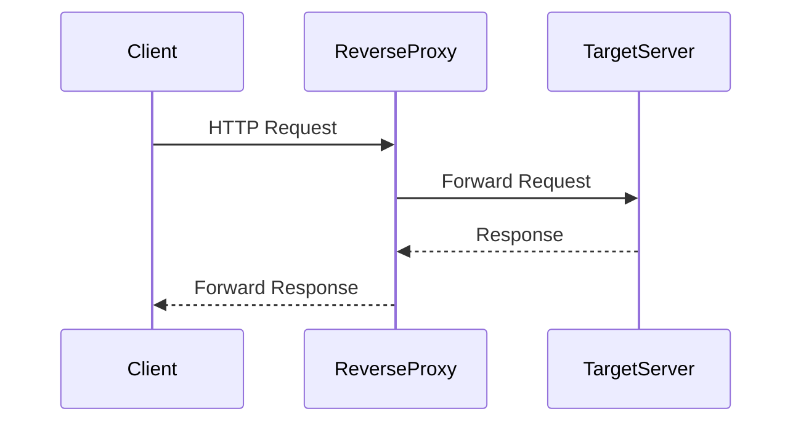

# ⚠️ Disclaimer

>This project is developed as a personal endeavor for educational purposes. It is not intended for production environments or critical applications. The author makes no representations or warranties regarding the functionality, security, or suitability of this software for any particular purpose. Users are advised to assess the software's suitability for their needs and use it at their own risk. The author shall not be held liable for any damages or issues arising from the use of this software.


# 🌐🔒 Node.js Reverse Proxy Service

This lightweight Node.js application functions as a reverse proxy, serving as the public-facing interface to route requests to a target service. It effectively masks the target service's IP, aiding in bypassing IP-based restrictions.

## ✨ Features

- 🔄 **Efficient Request Routing**: Forwards incoming HTTP requests to the designated backend service.
- 🕵️‍♂️ **IP Obfuscation**: Conceals the actual IP address of the target service, enhancing accessibility.
- ⚡ **Lightweight**: Minimal resource usage, ensuring swift and reliable performance.

## 💻 System Interaction Overview



## 🛠️ Prerequisites

- 🌐 **Node.js**: Ensure Node.js is installed on your system. Download it from [nodejs.org](https://nodejs.org/).

## 📝 Installation

1. **Clone the Repository**:
   
   ```bash
   git clone https://github.com/brkcoc02/reverse-proxy.git
   ```

2. **Navigate to the Project Directory**:

    ```bash
    cd reverse-proxy
    ```

3. **Install Dependencies**:

    ```bash
    npm install
    ```

## ⚙️ Configuration

You can configure the application using either environment variables or a .env file:

### 🌱 Option 1: Direct Environment Variables

Define the following environment variables to configure the application:
- 🌐 `TARGET_URL`: The URL of the target service to which requests will be proxied.
- 🔢 `PORT`: The port number on which the proxy server will listen.

For example, in a Unix-based environment:
```bash
export TARGET_URL='http://your-target-service.com'
export PORT=3000
```

### 🗂️ Option 2: Using .env File (For Local Development)

1. 📝 Create a `.env` file in the project root directory
2. 📝 Add your configuration:
```
TARGET_URL=http://your-target-service.com
PORT=3000
```

🔒 Note: The `.env` file is ignored by Git for security. Use the provided `.env.example` as a template.

🌐 For deployment platforms like render.com, configure these environment variables in your deployment platform's dashboard.

## 🚀 Usage

1. **Start the Proxy Server**:

    You can start the server using either of the following commands:

   - Using npm:

     ```bash
     npm start
     ```

   - Directly with Node.js:

     ```bash
     node index.js
     ```

   Ensure that the `start` script in your `package.json` is correctly configured if you choose to use `npm start`.

2. **Access the Proxy**:

    🌐 Direct your client applications to the proxy server's address (e.g., `http://localhost:3000`) to have requests forwarded to the target service.

## 🤝 Contributing

Contributions are welcome! Please follow these steps:

1. 🍴 Fork the repository.
2. 🌿 Create a new branch for your feature or bug fix.
3. 📝 Commit your changes with clear and descriptive messages.
4. ⬆️ Push your changes to the branch.
5. 🔄 Submit a pull request detailing your changes.

## 📄 License

📜 This project is licensed under the MIT License. See the [LICENSE](LICENSE) file for details.

## 📬 Contact

📧 For questions or feedback, please open an issue in the repository or contact [brkcoc02@gmail.com](mailto:brkcoc02@gmail.com).
